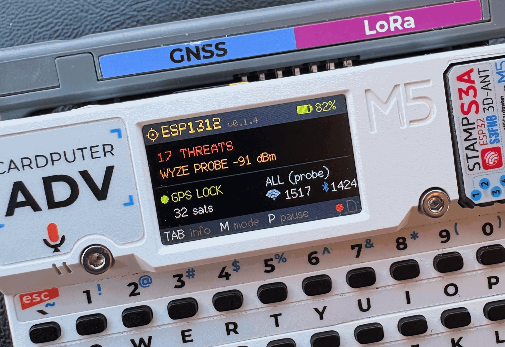
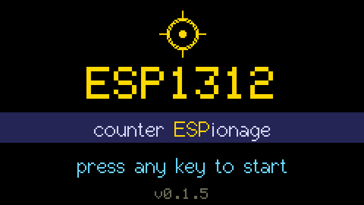
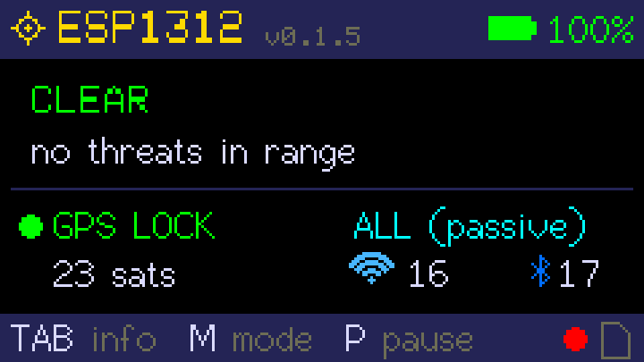
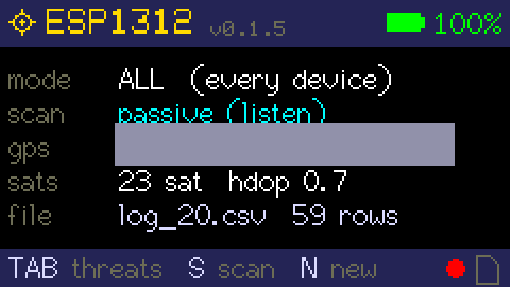
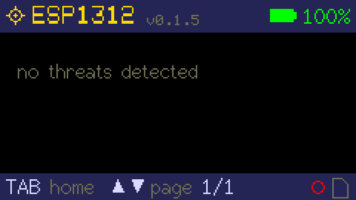
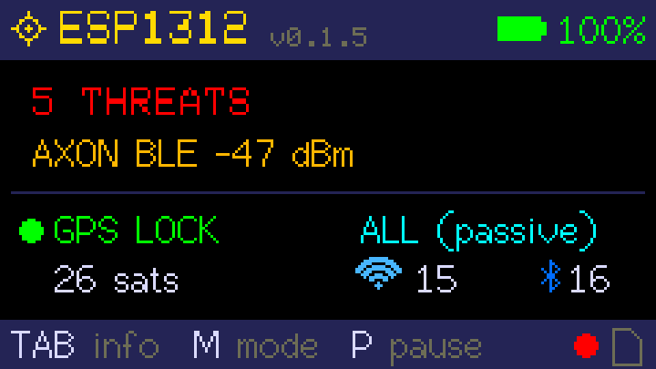
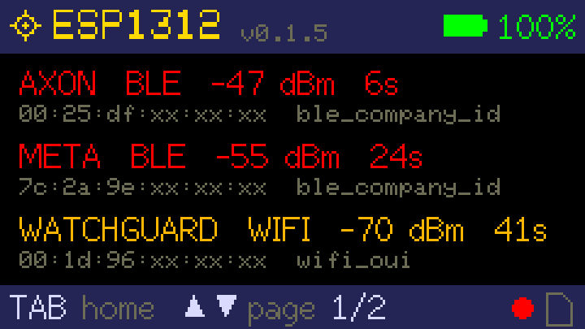

# ESP1312

**Counter ESPionage for the Cardputer ADV**



ESP1312 is a geotagged WiFi + BLE surveillance-device logger for the **[M5Stack Cardputer ADV](https://docs.m5stack.com/en/core/Cardputer-Adv)** with the [M5 LoRa-1262 Cap](https://docs.m5stack.com/en/cap/Cap_LoRa-1262), whose GPS does the geotagging. It logs fields that most wardriving firmwares drop (BLE company ID, manufacturer data, service UUIDs, address type, WiFi probe requests), so gear that rotates its MAC or never beacons (Axon, Meta, Flock, though Flock is getting harder to detect as newer units advertise less) still gets caught.

There are four kinds of records. `WIFI` is an access point from the scan, `BLE` is an advert, `PROBE` is a WiFi client calling out for its network (caught in promiscuous mode from devices that use a real MAC), and `RID` is a drone's Remote ID beacon.

## How it compares

ESP1312 shares the Cardputer with other wardriving firmware. [Bruce](https://github.com/BruceDevices/firmware) and [Evil Cardputer](https://github.com/7h30th3r0n3/Evil-M5Project) run on the same board, and off-Cardputer tools like the [Biscuit](https://codehedge.github.io/Biscuit-Wiki/devices/diy.html) (a [Marauder](https://github.com/justcallmekoko/ESP32Marauder)-based, dual-band wardriver) cover the same ground. They are built to count every access point and Bluetooth device you pass, geotagged, in [WiGLE](https://wigle.net/) format. They do it well, often better than ESP1312 at raw coverage. The Biscuit's dual-band radio hears 5 GHz the Cardputer's 2.4 GHz radio can't, and a longer drive logs more.

ESP1312 is built for a more specific use case. It picks out which of those devices are surveillance gear, and records enough to confirm/deny it later. So it keeps the fields the WiGLE format drops. As an example, driven next to a Biscuit over one shared route, this is what each log held:

| Field                               |     ESP1312 |                    Biscuit |
|-------------------------------------|------------:|---------------------------:|
| WiFi probe requests (clients)       |         159 |            0, not captured |
| BLE company / manufacturer ID       |  9,014 rows |                    21 rows |
| BLE service UUIDs                   |  1,756 rows |                  no column |
| BLE address type (pub/rnd/rpa/nrpa) |   every row |       flattened to `[BLE]` |
| Manufacturer-data bytes             |         yes |                  no column |
| Signature match saved to the log    | 370 devices | app-side alert, not logged |

That's just one measured drive as an example. Pulled from each firmware's code and docs, this is what I believe each wardrive log records:

| Wardrive log records                   | ESP1312 | Bruce  | Evil Card | Biscuit |
|----------------------------------------|:-------:|:------:|:---------:|:-------:|
| WiFi APs, geotagged                    |   ✓    |   ✓   |    ✓     |   ✓    |
| BLE devices, geotagged                 |   ✓    |   ✓   |    no     |   ✓    |
| BLE company ID                         |   ✓    |   ✓   |    no     | rarely  |
| BLE service UUIDs                      |   ✓    |   no   |    no     |   no    |
| BLE address type (rpa/rnd)             |   ✓    |   no   |    no     |   no    |
| Manufacturer-data bytes (Find My type) |   ✓    |   no   |    no     |   no    |
| WiFi probe requests                    |   ✓    |   no   |    no     |   no    |
| Drone Remote ID                        |   ✓    |   no   |    no     |   no    |
| Signature match written to the log     |   ✓    | no[^1] |  no[^1]   | no[^1]  |
| Open source                            |   ✓    |   ✓   |    ✓     |   no    |

[^1]: Bruce and Evil Cardputer beep live surveillance and tracker alerts, and the Biscuit flags Flock, Meta, and Axon in its phone app. None write the match into the geotagged log, so you can't audit or map a hit after the drive.

WiGLE has no column for most of those fields, so no setting turns them on and the file can't hold them. ESP1312 defines its own CSV and an open signature table (`src/signatures.h`) you can read and edit. It matches on-device and writes every raw field to the card, so a hit stands up to a second look. A rotating `rpa` address with a fixed company ID is the classic "hiding but identifiable" pattern. It needs both halves, and ESP1312 is the only one here that records both.

## Build and flash

This is a 0.x pre-release. I've only run it on my own hardware, so expect rough edges and please open an issue when you hit one.

Prebuilt images are on the Releases page. `ESP1312.bin` is the full image with bootloader and partition table. `ESP1312-app.bin` is the app alone.

**Over USB**, with PlatformIO:

```bash
pio run -e cardputer -t upload
pio device monitor -e cardputer     # 115200: [SD] / [HIT] lines
```

**From the SD card**, with [Launcher](https://github.com/bmorcelli/Launcher):

1. Copy the image into the card's `/downloads` folder.
2. In Launcher, pick the file and flash it.

Which file to copy:

- `ESP1312-app.bin` keeps Launcher on the device. Tested with Launcher 2.9.1 on the Cardputer ADV, so start here.
- `ESP1312.bin` wipes the whole flash, Launcher included, so it always boots, but you'll need to reflash Launcher to get it back.

A local build produces the same two files as `.pio/build/cardputer/firmware.factory.bin` and `firmware.bin`.

## Screen

On boot, a splash screen shows the wordmark, version, and `counter ESPionage` tagline, then waits for a keypress before it starts driving:



The home screen shows `CLEAR` or `N THREATS` plus the last hit, GPS state, mode, and device counts. TAB cycles to the details view (mode, scan type, coordinates, sats, filename, and row count), then to the threats list. That list shows every signature hit seen, newest first, with its radio, signal, age, MAC, and what matched. The header carries a battery gauge; the footer shows a blinking record dot (or two pause bars when logging is paused) and an SD-card icon that turns red when no card is mounted.

When a signature fires, primary text on the home screen turns red with the count and last hit, and the threats list fills in newest-first. Fresh hits (under 30 s) are red, older ones orange.

|            |                    Home                     |           Details            |                 Threats                  |
|------------|:-------------------------------------------:|:----------------------------:|:----------------------------------------:|
| **clear**  |                       |  |              |
| **threat** |  |             n/a              |  |

Screenshots here come from the `g` serial command, which dumps the live screen buffer over USB (see [Serial](#serial)). GPS coordinates are blocked out.

You can press `S` to switch scan modes. Passive listens only and probe actively sends requests and pulls hidden SSIDs (at the cost of being loud on the air).

| Key | Action                                                                  |
|-----|-------------------------------------------------------------------------|
| TAB | home / details / threats                                                |
| ; . | page through the threats list                                           |
| M   | mode: ALL, HUNT, WIGLE (opens a new file, HUNT switches to active scan) |
| S   | scan passive (listen only) / active (sends probes and scan requests)    |
| P   | pause / resume logging                                                  |
| N   | new log file                                                            |

## Serial

While building this I spent a lot of time debugging over USB serial, so I added a few commands to make that easier. Connect at 115200 with `pio device monitor`, `screen`, or anything else. The keyboard keys work here too, and the firmware prints `[SD]` and `[HIT]` lines as things happen plus a `[mem]` line every 30 s with free heap and counts.

| Command   | What it does                                                                                                     |
|-----------|------------------------------------------------------------------------------------------------------------------|
| `d`       | Streams the current log file between `[DUMP]` and `[END]`, so you can check a recording without pulling the card |
| `f<name>` | Same for an older file, by path under `/ESP1312/` (say `fYYYY-MM-DD/log_4.csv`)                                  |
| `h`       | Prints the threats table                                                                                         |
| `l`       | Lists the log folder                                                                                             |
| `x`       | Deletes every log except the one currently open                                                                  |
| `g`       | Sends the screen as raw pixels (240x135, one RGB332 byte each) for screenshots, including the splash             |
| `v`       | Moves to the next screen                                                                                         |
| `G`       | Prints one line of GPS state (RX pin, baud, NMEA and checksum counts, sats, fix)                                 |

## Files

Everything lands in `/ESP1312/` on the card as `.csv`, in a per-day subfolder. A file opens as `/ESP1312/log_N.csv` and moves into `/ESP1312/YYYY-MM-DD/log_N.csv` as soon as GPS knows the date, so each day's folder stays small and the log-open stays fast no matter how long you drive it. The date is local, using the `TZ_HOURS` build flag (set it to your own UTC offset). Times inside the file stay UTC.

| Mode  | File          | Rows                                                                                                                     |
|-------|---------------|--------------------------------------------------------------------------------------------------------------------------|
| ALL   | `log_N.csv`   | every device: `time,type,mac,rssi,chan,enc,company_id,mfg_data,service_uuids,name,vendor,method,lat,lon,alt_m,sats,hdop` |
| HUNT  | `hits_N.csv`  | same columns, signature hits only                                                                                        |
| WIGLE | `wigle_N.csv` | standard WiGLE 1.6 header, BLE rows carry `MfgrId` = company ID, no PROBE rows                                           |

`enc` is WPA2/OPEN/... for WiFi, `probe` or `rid` for sniffed frames, and the address type for BLE: `pub`, `rnd` (static random), `rpa` (rotates), `nrpa` (rotates). A rotating `rpa` with a fixed company ID is the classic "hiding but identifiable" signature. `mfg_data` is the first four bytes after the company ID, which is where Apple's Find My type byte lives.

Names and UUID lists are made CSV-safe before they're written. Commas and quotes become spaces, anything outside printable ASCII becomes `?`, and a name that starts with `=`, `+`, `-` or `@` gets a leading `'` so a spreadsheet shows it as text instead of running it as a formula.

A MAC is re-logged after it moves more than 25 m or 20 s pass. Every signature hit chirps, in any mode, except trackers (AirTag, Tile, SmartTag). Those get the vendor column filled in but stay out of the chirp and the threat count, since they're usually not a real threat.

The signature table is in `src/signatures.h`, and where each row came from and how far it's trusted is in `SIGNATURES.md`. The research behind it, including what can't be detected this way, is in `reference/le-gear-signatures.md`.

## Wiring and knobs

The pin defaults live in `src/main.cpp`. SD is on SCK 40 / MISO 39 / MOSI 14 / CS 12. `TZ_HOURS` is the one flag already set in `platformio.ini`.

GPS is found by probing, so any NMEA module on the LoRa cap (RX 15 / TX 13) or on the Grove port (pins 1 and 2, either way round) should work with the same build. The cap is tested; the Grove path is not yet, so reports either way are welcome. Every 5 s without a valid sentence the firmware moves on: silence means the wrong pins, garbage means the wrong baud. It tries 115200, 9600, 38400, 4800 and 57600, and a module on the cap typically locks within 5 s, one on the Grove port within 20 s. The Grove pins are listened to only, never driven, so a module there that needs a command before it will talk is not supported. `-D GPS_RX`, `GPS_TX` and `GPS_BAUD` build flags replace the first pair and baud tried, for wiring the probe does not cover. The details view shows the RX pin and baud being tried plus the passed-checksum count, so a module the probe never finds shows up as `ok 0` while the pin and baud keep changing.

The ADV needs GPIO5 high before the SD card will answer. The firmware does that, then mounts at 4 MHz on HSPI.

## Check

```bash
c++ -std=c++17 -Isrc test_sig.cpp && ./a.out    # signature matcher and CSV escaping, prints ok
```
